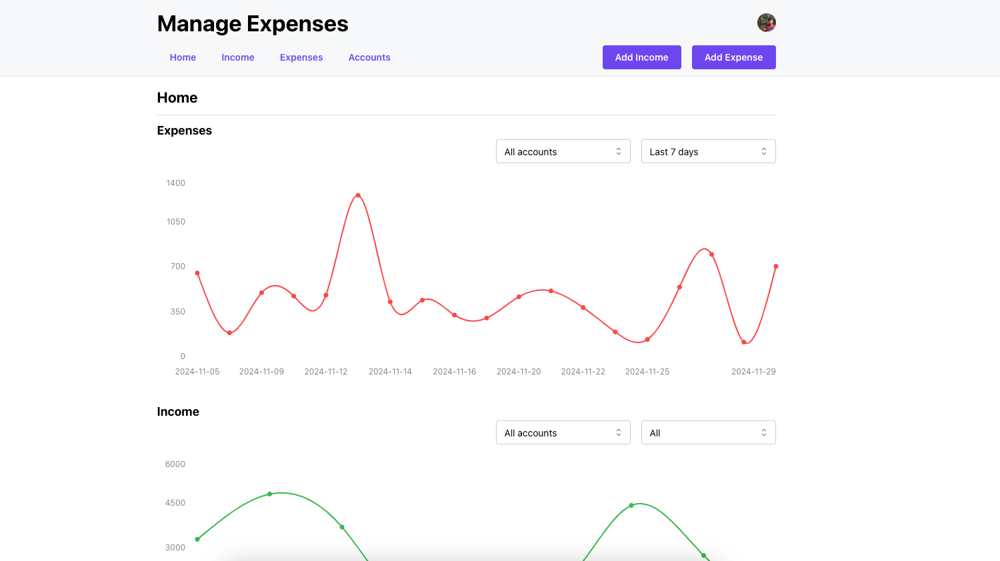

# Expense Tracker

A modern expense tracking application built with Remix, Mantine UI, and Prisma. Track your expenses and income across multiple accounts with detailed analytics and filtering capabilities.



## Features

- 📊 Dashboard with expense and income charts
- 💰 Multiple account management
- 🏷️ Tag-based expense categorization
- 📅 Date-based filtering
- 📱 Responsive design
- 🔒 User authentication with Clerk
- 📈 Visual analytics and trends

## Tech Stack

- **Framework**: Remix
- **UI Library**: Mantine UI
- **Database**: PostgreSQL
- **ORM**: Prisma
- **Authentication**: Clerk
- **Charts**: Mantine Charts
- **Styling**: PostCSS
- **Type Safety**: TypeScript

## Getting Started

1. Clone the repository
2. Install dependencies:

```bash
npm install
```

3. Set up your environment variables:

```bash
DATABASE_URL="your_postgresql_url"
CLERK_SECRET_KEY="your_clerk_secret"
CLERK_PUBLISHABLE_KEY="your_clerk_publishable_key"
```

4. Run database migrations:

```bash
npx prisma migrate dev
```

5. Start the development server:

```bash
npm run dev
```

## Database Schema

The application uses a PostgreSQL database with the following main models:
- Accounts
- Expenses
- Income
- Tags
- User Settings

## Contributing

Contributions are welcome! Please feel free to submit a Pull Request.
